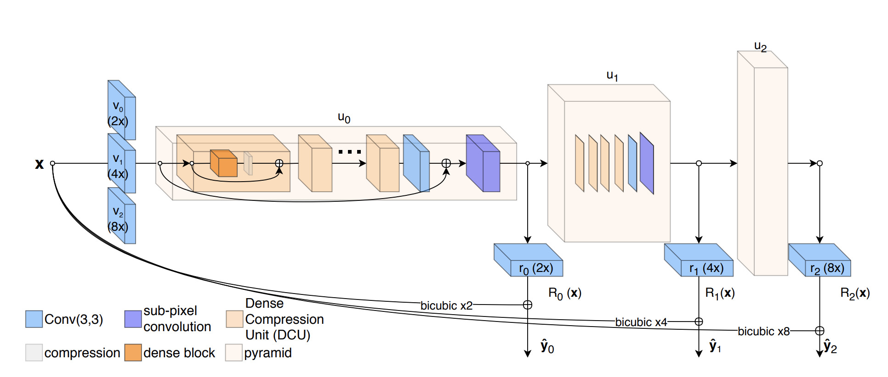

# ProSR

Unofficial implementation of [A Fully Progressive Approach to Single-Image Super-Resolution](https://fperazzi.github.io/files/publications/prosr.pdf).


ProSR is an SISR method designed upon the principiple of multi-scale progressiveness. The architecture resemble an asymmetric pyramidal structure with more layers in the lower levels to enable high upsampling ratios while remaining efficient. The training procedure implements the learning paradigm of curriculum learning by gradually increasing the difficulty of the learning task.


## Usage
### System Requirements
*ProSR* is developed under Ubuntu 16.04 with CUDA 9.1, cuDNN v7.0 and pytorch-0.4.0.
We tested the program on Nvidia Titan X and Tesla K40c GPU. Any GPU with ~12GB memory will do. Parallel processing on multiple GPUs will be supported during training.

### Dependencies and Installation
  * Python 3.x
  * pytorch 0.4.0
  * See the full list of dependencies in `PROJECT_ROOT/conda-deps.yml`.

Dependencies can be installed in a conda enviroment executing:
`conda create --name proSR --file PROJECT_ROOT/conda-deps.yml`

### Configuration
The available options are defined in `lib/prosr/config.py`.

### Training
Not implemented yet. Send an email to [fperazzi@adobe.com](fpearzzi@adobe.com) if you want to be notified.

### Testing
The script `test.py` takes as input a list of images and the weights of the pretrained model and output their x8 upsampling. The command line is:

 `python test.py -i <list-of-images> -w <model-parameters.pth> -o <output-dir>`

The output images are postfixed with "_proSR". If `--output-dir` is left undefined, they will be saved in the same folder of the input images.

## Data
### Pretrained Models
In `PROJECT_ROOT/data` we provide a script `get_data.sh` to download the a pretrained model for x8 upsampling. This model was trained on the [DIV2K](http://data.vision.ee.ethz.ch/cvl/DIV2K/DIV2K_train_HR.zip) dataset. On the "Track 1" of the [NTIRE Super-Resolution Challenge 2018](https://competitions.codalab.org/competitions/18015), it ranked 4th place in terms of PSNR and second when measured with SSIM.

TLDR; `sh data/get_data.sh`

### Results
Coming soon...

## Publication
If this code helps your research please considering citing the following paper.

A Fully Progressive Approach to Single-Image Super-Resolution - <i>[Y. Wang](https://yifita.github.io), [F. Perazzi](fperazzi.github.io), [B. McWilliams](https://www.inf.ethz.ch/personal/mcbrian/), [A. Sorkine-Hornung](http://www.ahornung.net/), [O. Sorkine-Hornung](http://igl.ethz.ch/people/sorkine/), [C. Schroers](https://www.disneyresearch.com/people/christopher-schroers/)</i> - CVPR Workshops NTIRE 2018.
```
@InProceedings{Wang_2018_CVPR_Workshops,
    author = {
      Wang, Y. and
      Perazzi, F. and
      McWilliams, B. and
      Sorkine-Hornung, A. and
      Sorkine-Hornung, O and
      Schroers, C.},
  title = {A Fully Progressive Approach to Single-Image Super-Resolution},
  booktitle = {CVPR Workshops},
  month = {June},
  year = {2018}
}
```

## Contacts
If you have any question please contact [Federico Perazzi](fperazzi@adobe.com).
