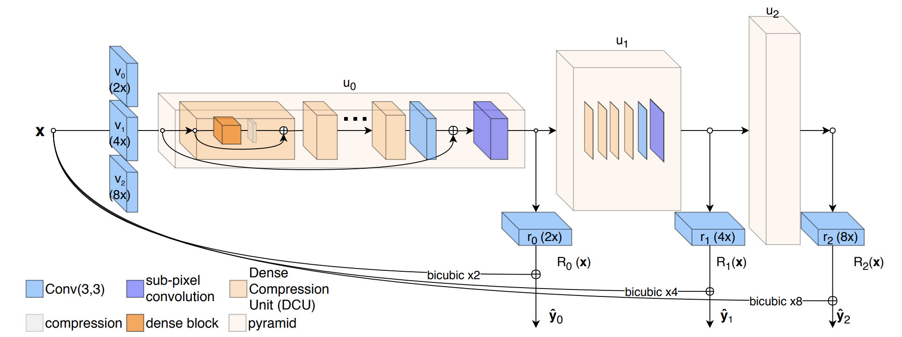

# ProSR

## A Fully Progressive Approach to Single-Image Super-Resolution
### Co-winner of the [NTIRE Super-Resolution Challenge 2018](https://competitions.codalab.org/competitions/18015)


**ProSR** is a Single Image Super-Resolution (SISR) method designed upon the principle of multi-scale progressiveness. The architecture resembles an asymmetric pyramidal structure with more layers in the upper levels, to enable high upsampling ratios while remaining efficient. The training procedure implements the paradigm of curriculum learning by gradually increasing the difficulty of the task.

[[Paper]](https://fperazzi.github.io/files/publications/prosr.pdf)[[ArXiv]](https://arxiv.org/abs/1804.02900)

## Installation
Follow the instructions below to get **ProSR** up and running on your machine, both for development and testing purposes.

**ProSR** is developed under Ubuntu 16.04 with CUDA 9.1, cuDNN v7.0 and pytorch-0.4.0. We tested the program on Nvidia Titan X and Tesla K40c GPUs. Parallel processing on multiple GPUs is supported during training.
### System Requirements

### Dependencies
  * python 3.x
  * pytorch 0.4.0
  * cuda91
  * torch
  * torchvision
  * scikit-image
  * pillow
  * easydict

#### Install Dependencies
```
# Create virtual environment
conda create -n proSR

# Install torch
conda install pytorch=0.4.1 torchvision cuda91 -c pytorch

# Install image libraries
conda install scikit-image cython

# Install visdom
conda install visdom dominate -c conda-forge

# Install python dependencies
python3.7 -m pip install easydict pillow
```

#### Search Path

`export PYTHONPATH=$PROJECT_ROOT/lib:$PYTHONPATH` to include `proSR` into the search path.

## Getting the Data
We provide a script `data/get_data.sh` to download the pretrained models and datasets that we used in this project. This is a large download of approximately 10GB that might take a while to complete. Individual links to the models and datasets are available in the next sections.

### Datasets
The results reported in the paper are trained on [DIV2K](https://data.vision.ee.ethz.ch/cvl/DIV2K). Improved performance, at the expenses of longer training time, can be obtained adding [Flickr2K](http://cv.snu.ac.kr/research/EDSR/Flickr2K.tar) to the training set. The pretrained models released in this repository have been trained with DIV2K and Flickr2K.

We evaluated the performance of ProSR on the following benchmark datasets:

* [Set5 - Bevilacqua et al. BMVC 2012](http://people.rennes.inria.fr/Aline.Roumy/results/SR_BMVC12.html)
* [Set14 - Zeyde et al. LNCS 2010](https://sites.google.com/site/romanzeyde/research-interests)
* [B100 - Martin et al. ICCV 2001](https://www2.eecs.berkeley.edu/Research/Projects/CS/vision/bsds/)
* [Urban100 - Huang et al. CVPR 2015](https://sites.google.com/site/jbhuang0604/publications/struct_sr)

A package containing all of the above benchmark datasets was made available by the [EDSR](https://github.com/thstkdgus35/EDSR-PyTorch) colleagues: [benchmark.tar](https://cv.snu.ac.kr/research/EDSR/benchmark.tar)

### Pretrained Models
We release the following models:

* [proSR](https://www.dropbox.com/s/3fjp5dd70wuuixl/proSR.zip?dl=0) - This is the full size model that ranked 2nd and 4th place respectively in terms of PSNR and SSIM on the "Track 1" of the [NTIRE Super-Resolution Challenge 2018](https://competitions.codalab.org/competitions/18015).
* [proSRs](https://www.dropbox.com/s/ldv397lcr3vn95w/proSRs.zip?dl=0) - A lightweight version of ProSR. Best speed / accuracy tradeoff.
* [proSRGAN](https://www.dropbox.com/s/ulkvm4yt5v3vxd8/proSRGAN.zip?dl=0) - ProSR trained with an adversarial loss. Lower PSNR but higher details.

The above models perform well across different upscaling ratios [2,4,8]. However, best performance is achieved using scale specific models. These models are available in the same folder and are post-fixed with `_xSCALE` (e.g. `proSR_x8.pth`) to indicate at which regime they perform best.


## Results
Following wide-spread protocol, the quantitative results are obtained converting RGB images to YCbCr and evaluating the PSNR and SSIM on the Y channel only.

| [proSRs](https://www.dropbox.com/s/ldv397lcr3vn95w/proSRs.zip?dl=0) | DIV2K | Set14 | BSD100| Urban100 | [proSR](https://www.dropbox.com/s/3fjp5dd70wuuixl/proSR.zip?dl=0) | DIV2K | Set14 | BSD100| Urban100 |
|--------|-------|-------|-------|----------|-------|-------|-------|-------|----------|
| **x2** | 35.88 | 33.52 | 32.00 | 31.61    | **x2**| 36.37 | 34.12 | 32.23 | 32.68    |
| **x4** | 30.39 | 28.64 | 27.50 | 26.02    | **x4**| 30.78 | 28.94 | 27.68 | 26.74    |
| **x8** | 26.89 | 24.92 | 24.71 | 22.44    | **x8**| 27.18 | 25.25 | 24.86 | 22.91    |

Results slightly differ from those reported in the paper for several reasons: this is an independent re-implementation; differently from the paper we trained on on DIV2K and Flickr2K; I picked the best performers validating on Set14 instead of DIV2K.

## Training
Train your own model using the script `train.py`:
```
# Train using default params
python train.py --model MODEL --output DIR

# Train with configuration file
python train.py --config CONFIG.yaml
```

`MODEL` is one of `prosr` or `prosrs`. The configuration is defined in `prosr/config.py`. Checkpoints and log files are stored in `DIR`. Alternatively, the `--config` flag reads configuration files in `yaml` format. In `PROJECT_ROOT/options` we provide config files corresponding to the architectures proposed in the paper.

See `train.py` for more options.

#### Training Paper Experiments
```
# Train ProSRs from params dict
python train.py --model prosrs --output data/checkpoints/proSRs

# ProSR from configuration file
python train.py --config options/prosr.yaml --output data/checkpoints/proSR
```

### Loading the dataset
Set the path to the dataset in `configs.py:prosr_params.train.path{source,target}`. To **train on multiple datasets** create a new folder containing soft links to the datasets, you want to use for training. For example: `ensemble/{DIV2K_train_HR,Flickr2K}`.

`train.path.source` is optional. If left empty, the dataloader will downsample the target images found in `train.path.target` to the predefined lower resolution.

#### Resume Training
To resume training from a checkpoint, e.g. `data/checkpoints/PRETRAINED_net_G.pth`:
```
python train.py --checkpoint data/checkpoints/PRETRAINED
```

#### MultiGPU Training
By default, all available GPUs are used. To use specific GPUs use `CUDA_VISIBLE_DEVICES`, e.g. `export CUDA_VISIBLE_DEVICES=0,1`

#### Visualization
To visualize intermediate results (optional) run the `visdom.server` in a separate terminal and enable visualization passing the command line arguments: `--visdom --visdom-port PORT-NUMBER`.

```
# Run the server in a separate terminal
python -m visdom.server -port 8067
```

## Testing
Run:
```
python test.py -i LR_INPUT (optional) -t HR_INPUT (optional) --checkpoint CHECKPOINT --scale NUMBER
```
`LR_INPUT` is the low-resolution input and can be a folder, an image or a list of images. If high-resolution images are provided (`HR_INPUT`), the script will compute the resulting PSNR and SSIM. Alternatively, if only high-resolution images are given as argument, the script will scale `HR_INPUT` by the inverse of the upscale factor `NUMBER` and use the result as `LR_INPUT`.

`CHECKPOINT` is the path to the pretrained *\*.pth* file.

#### Example
```
# ProSR: Replicate x8 results
python test.py --checkpoint data/checkpoints/proSR.pth --target data/datasets/DIV2K/DIV2K_valid_HR --scale 8
```


#### Docker example
```bash
# Build the image with GPU support
nvidia-docker build -t prosr .

# Scale a folder by 8x
nvidia-docker run -it --name prosr --shm-size=4G -v INPUT_DATA/:/data prosr \
    python test.py -i /data --checkpoint data/proSR/proSR_x8.pth --scale 8 -o /data/output
```

## Additional Tools

### Configuration

The configuration file and the command-line options are embedded as a dictionary in the respective *.pth. file. Print the configuration file using the command:

```
python tools/print_info.py data/checkpoints/proSR.pth
```


### Downscaling
The models available for download have been trained on images downscaled with a bicubic filter. To replicate the same type of downsampling we provide the script `tools/scale.py`.

```
python scale.py -i HR_INPUT -o LR_OUTPUT --ratio 8
```

### Evaluation
Results can be evaluated in terms of PSNR and SSIM using the script `tools/eval.py`. The command-line is similar to `test.py`:

```
python tools/eval.py -i LR_INPUT -t HR_INPUT --scale NUMBER
```

The input can be either a folder, an image or a list of images. The upsampling factor is required since the boundary cropping depends on it.

## Publication
If this code helps your research, please consider citing the following paper.

**A Fully Progressive Approach to Single-Image Super-Resolution** - <i>[Y. Wang](https://yifita.github.io), [F. Perazzi](fperazzi.github.io), [B. McWilliams](https://www.inf.ethz.ch/personal/mcbrian/), [A. Sorkine-Hornung](http://www.ahornung.net/), [O. Sorkine-Hornung](http://igl.ethz.ch/people/sorkine/), [C. Schroers](https://www.disneyresearch.com/people/christopher-schroers/)</i> - CVPR Workshops NTIRE 2018.

```
@InProceedings{Wang_2018_CVPR_Workshops,
    author = {
      Yifan, W. and
      Perazzi, F. and
      McWilliams, B. and
      Sorkine-Hornung, A. and
      Sorkine-Hornung, O and
      Schroers, C.},
  title = {A Fully Progressive Approach to Single-Image Super-Resolution},
  booktitle = {CVPR Workshops},
  month = {June},
  year = {2018}
}
```
## Contacts
If you have any question, please contact [Yifan Wang](yifan.wang@inf.ethz.ch) and [Federico Perazzi](fperazzi@adobe.com).

#### Update Log
* Sept. 10, 2018
    * Upload ProSR models.
    * Add ProSR evaluation in README.
* Sept. 16, 2018
    * Upload proSRGAN models.
